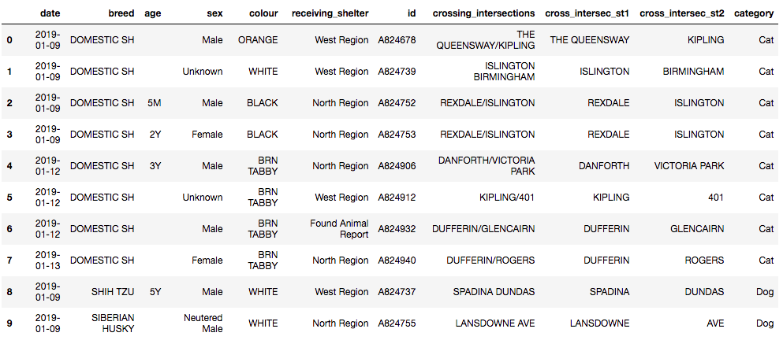
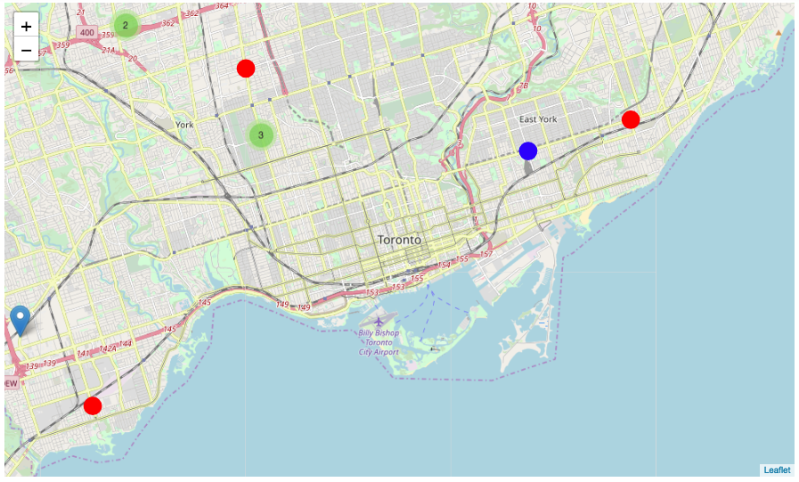
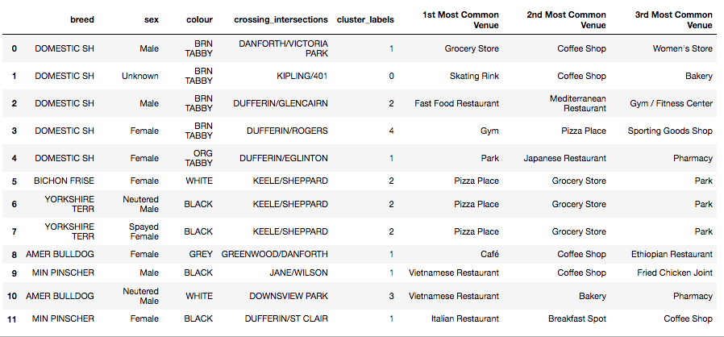

# IBM Applied Data Science Capstone Project

## LOST PETS OF TORONTO SEGMENTATION REPORT

### 1. PURPOSE
***
This report provides the details about my IBM Applied Data Science Capstone Project for peer reviewing assessment. The complete results and the Python code can be viewed from https://github.com/gomesluiz/Coursera_Capstone/blob/master/w5_source_code.ipynb.

### 2. INTRODUCTION
***
Lost pets have become a severe problem in many cities. Pets owners usually take a long time to find them or even they may never find their pets because, for example, these pets might be moved far from where they used to live. On the other hand, ONGs have high difficulty to rescue rejected pets, so these ONGs are not often alerted about them or when are these pets have already moved to another place.  Discovering and understanding unusual patterns about these lost pets (e.g. local characteristics where they were encountered) from data provided by many public agencies or ONG's could guide them in actions or help them to promote campaigns to mitigate the problem. 

For demonstration, I have used the data provided by Animal Services of City of Toronto (https://www.toronto.ca/data/mls/animals/strayanimals.html). I prefer to use the nearest crossing intersection where a pet was encountered as the basic geographical localization to retrieve FourSquare data for clustering and segmentation. Unfortunately, this report displays only stray animals received in the last 5 days.


### 3. DATA DESCRIPTION AND ACQUISITION 
***

This demonstration will make use of the following data sources:

#### Animal Services of The City of Toronto

The **Stray Animals Report** provide by The Animal Services of The City of Toronto displays stray animals  (cats and dogs) received in the last 5 days. The report data will be scraped from https://www.toronto.ca/data/mls/animals/strayanimals.html and contains the following information:

* **Category:** Cat or Dog
* **Date**  
* **Breed** 
* **Approximate Age** 
* **Sex:** Male or Female 
* **Colour**
* **Receiving Shelter**
* **Animal ID Number** 
* **Crossing Intersection**


 The **Localisation of Receiving Shelters** data provided by The Animal Services of City of Toronto will be scraped from https://www.toronto.ca/community-people/animals-pets/animal-shelters/ and contains the following information:
 
* **Title**
* **Address**  

#### Geocoder of Crossing Intersection Coordinates.

**The Coordinates of Crossing Intersections** The Geocoder (https://geocoder.api.here.com) will be used to get the geographical coordinates. The following information are retrieved on the query:

* **Latitude and Longitude**

#### Foursquare Venues Data

**The Nearest Venues of Crossing Intersections** The FourSquare (www.foursquare.com) API will be used to explore venues in Toronto nearby **Crossing Intersections**. The Foursquare explore function will be used to get the most common venue categories in each crossing intersection, and then use this feature to group the crossing intersections into clusters. The following information are retrieved on the query:

* **Venue ID**
* **Venue Name**
* **Latitude and Longitude**
* **Category Name**


## 4. METODOLOGY

### Lost and Found Pets
The data source contains the information about stray animals received in the last 5 days by The Animal Services of the City of Toronto. 

**1. Data Cleaning** 
The report is available in two HTML tables (cats and dogs). These table contains some inconsistent entries and needs some cleanup.

The following activities were performed:

* Drop/ignore cells with missing crossing intersections data
* Fix cells with crossing intersections wrong format.
* Separate crossing intersections fields in street 1 and street 2.

**Post processed sample Lost and Found pets table.**


**2. Localisation of crossing intersections** 
The Geocoder Service (https://geocoder.api.here.com) was used to find latitude and longitude of crossing intersections. These geographical coordinates will be used to search FourSquare API location data.

**The Python code used to retrieve geographical coordinates for crossing intersections.**

```python 
def get_cross_intersec_localization(pets):
    url = 'https://geocoder.api.here.com/6.2/geocode.json?city={}&street={}@{}&app_id={}&app_code={}&gen=9'
    api_id   = '79foQR1GPJRvsWDGB0Ul'
    api_code = 'E5YKLSl_O29hf-ipUlPFfQ'
   
    for row in pets.itertuples():
        address = url.format('Toronto'
                         , row.cross_intersec_st1
                         , row.cross_intersec_st2
                         , '79foQR1GPJRvsWDGB0Ul'
                         , 'E5YKLSl_O29hf-ipUlPFfQ')
        response = requests.get(address).json()
        try:
            
            localization = json_normalize(response['Response']['View'][0]['Result'][0]['Location'])
            pets.loc[row.Index,'cross_intersec_latitude']   = localization.loc[0, 'DisplayPosition.Latitude']
            pets.loc[row.Index,'cross_intersec_longitude']  = localization.loc[0, 'DisplayPosition.Longitude']
        except Exception as e:
            print('Crossing intersection {}/{} was not found in geocode database: {}! '.format(
                  row.cross_intersec_st1
                , row.cross_intersec_st2
                , str(e)))
        
    return(pets)

```

**Post processed sample Lost and Found pets table merged with geographical coordinates.**


## 5. RESULTS

**1. Lost and Found pets, and Shelters Geographical Localisation**

The following piece of map was plotted using the crossing intersection and shelters geographical coordinates.



The above piece of map shows the close crossing intersections from where lost dogs (blue circles) and cats (red circles) were found. Furthermore, green circles represent the groups of pets encountered in the same near crossing intersections (the inner digit is a number of pets).  The light blue marker depicts a shelter.

**2. Clustering and Segmentation**

Using the Foursquare API, the explore API function was to be used to get the most common venue categories in each crossing intersection and then used this feature to group the crossing intersections into clusters. The k-means clustering algorithm was used for the analysis. Finally, the Folium library is used to visualize the emerging clusters.

**2.1 The most common venues for each crossing intersection** 


**2.2 The k-Means clusters yielded**


**2.2 Lost and found pets segmentation map** 


## 6. DISCUSSION AND CONCLUSION