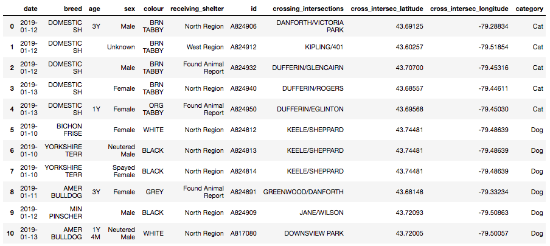

# CAPSTONE PROJECT: FINAL REPORT

## LOST AND FOUND PETS STATISTICS AND SEGMENTATION

### 1. PURPOSE
***

### 2. INTRODUCTION
***
Missed pets have become a severe problem in many cities. Pets owners usually take a long time to find them or even they may never find their pets because, for example, these pets might be moved far from where they used to live. On the other hand,  ONG's have high difficulty to rescue rejected pets, so these ONGs are not often alerted about them or when are these pets have already moved to another place. 

The mobile phones have already become part of the day-to-day of people's lives, who might provide using their mobile phones the geographic location and a photo of these missed or rejected pets. In its turn, pets owners and ONGs could search and visualize the geographic location of missed or rejected pets including points of references such as cafes and restaurants. Furthermore, governmental agencies could visualize and compare areas of the city with the highest incidence of missed ou rejected and could segment areas to uncover patterns which could guide marketing campaigns to mitigate the problem.

### 3. DATA DESCRIPTION AND ACQUISITION 
***

This prototype will make use of the following data sources:

#### Animal Services of The City of Toronto

The **Stray Animals Report** provide by The Animal Services of The City of Toronto displays stray animals  (cats and dogs) received in the last 5 days. The report data will be scraped from https://www.toronto.ca/data/mls/animals/strayanimals.html and contains the following information:

* **Category:** Cat or Dog
* **Date**  
* **Breed** 
* **Approximate Age** 
* **Sex:** Male or Female 
* **Colour**
* **Receiving Shelter**
* **Animal ID Number** 
* **Crossing Intersection**

 The **Localisation of Receiving Shelters** data provided by The Animal Services of City of Toronto will be scraped from https://www.toronto.ca/community-people/animals-pets/animal-shelters/ and contains the following information:
 
* **Title**
* **Address**  
 
**Toronto Venues nearby Crossing Intersections from FourSquare API (FourSquare website: www.foursquare.com)**

The FourSquare API will be used to explore neighborhoods in **Crossing Intersections** and **Receiving Shelters Localisation** in Toronto. The Foursquare explore function will be used to get the most common venue categories in each neighborhood, and then use this feature to group the neighborhoods into clusters. The following information are retrieved on the first query:

* **Venue ID**
* **Venue Name**
* **Coordinates:** Latitude and Longitude
* **Category Name**

## 4. METODOLOGY

### Lost and Found Pets
The data source contains the information about stray animals received in the last 5 days by The Animal Services of the City of Toronto. 

**Data Cleaning** The report is available in two HTML tables (cats and dogs). These table contains some inconsistent entries and needs some cleanup.

The following activities were performed:

* Drop/ignore cells with missing crossing intersections data
* Fix cells with crossing intersections wrong format.
* Separate crossing intersections fields in street 1 and street 2.

Post processed sample Lost and Found pets table.

**Localisation of crossing intersections** The Geocoder Service (https://geocoder.api.here.com) was used to find latitude and longitude of crossing intersections. These geographical coordinates will be used to search for venues using FourSquare API.

Post processed sample Lost and Found pets table with geographical coordinates.

## 5. SEGMENTATION AND CLUSTERING

## 6. DISCUSSION AND CONCLUSION