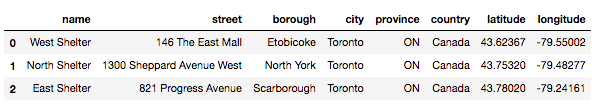
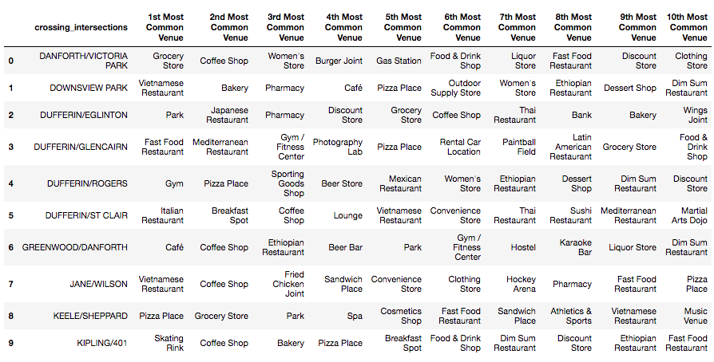

# IBM Applied Data Science Capstone Project

## Toronto Lost Pets Segmentation and Clustering

### 1. PURPOSE
***
This report provides the details about my IBM Applied Data Science Capstone Project for peer reviewing assessment. The complete results and the Python code can be viewed from https://github.com/gomesluiz/Coursera_Capstone/blob/master/w5_source_code.ipynb.

### 2. INTRODUCTION
***
Lost pets have become a severe problem in many cities. Pets owners usually take a long time to find them or even they may never find their pets because, for example, these pets might be moved far from where they used to live. On the other hand, ONGs have high difficulty to rescue lost pets, so these ONGs are not often alerted about them or when are these pets have already moved to another place.  Discovering and understanding unusual patterns about these lost pets (e.g. local characteristics) from data provided by many public agencies or ONG's could guide them in actions or help them to promote campaigns to mitigate the problem. 

For demonstration, I have used the data provided by Animal Services of City of Toronto (https://www.toronto.ca/data/mls/animals/strayanimals.html). I prefer to use the nearest crossing intersection where a pet was encountered as the basic geographical localization to retrieve FourSquare data for clustering and segmentation. Unfortunately, this report displays only stray animals received in the last 5 days.


### 3. DATA DESCRIPTION AND ACQUISITION 
***

For this demonstration will make use of the following data sources:

#### 3.1 Animal Services of The City of Toronto

The **Stray Animals Report** provide by The Animal Services of The City of Toronto displays stray animals  (cats and dogs) received in the last 5 days. The report data will be scraped from https://www.toronto.ca/data/mls/animals/strayanimals.html and contains the following information:

* **Category:** Cat or Dog
* **Date**  
* **Breed** 
* **Approximate Age** 
* **Sex:** Male or Female 
* **Colour**
* **Receiving Shelter**
* **Animal ID Number** 
* **Crossing Intersection**


 The **Localisation of Receiving Shelters** data provided by The Animal Services of City of Toronto will be scraped from https://www.toronto.ca/community-people/animals-pets/animal-shelters/ and contains the following information:
 
* **Title**
* **Address**  

The shelters informartion will be to plot theirs geographical localisation in the Folium map.

#### 3.2 Geocoder of Crossing Intersection Coordinates.

**The Coordinates of Crossing Intersections** The Geocoder (https://geocoder.api.here.com) will be used to get the geographical coordinates. The following information are retrieved on the query:

* **Latitude and Longitude**

#### 3.3 Foursquare Venues Data

**The Nearest Venues of Crossing Intersections** The FourSquare (www.foursquare.com) API will be used to explore venues in Toronto nearby **Crossing Intersections**. The Foursquare explore function will be used to get the most common venue categories in each crossing intersection, and then use this feature to group the crossing intersections into clusters. The following information are retrieved on the query:

* **Venue ID**
* **Venue Name**
* **Latitude and Longitude**
* **Category Name**


## 4. METODOLOGY

### 4.1 Lost and Found Pets Report

This data source contains the information about stray animals received in the last 5 days by The Animal Services of the City of Toronto. 

**1. Data Cleaning** 

The report is available in two HTML tables (cats and dogs). These table contains some inconsistent entries and needs some cleanup.

The following activities were performed:

* Drop/ignore cells with missing crossing intersections data
* Fix cells with crossing intersections wrong format.
* Separate crossing intersections fields in street 1 and street 2.

**Localisation of crossing intersections:** 
The Geocoder Service (https://geocoder.api.here.com) was used to find latitude and longitude of crossing intersections. These geographical coordinates will be used to search FourSquare API location data.

**The Python code used to retrieve geographical coordinates from geocoder services.**
```python 
def get_coordinates(city, street1, street2=''):
    
    api_id   = '79foQR1GPJRvsWDGB0Ul'
    api_code = 'E5YKLSl_O29hf-ipUlPFfQ'
    latitude = longitude = 0.0
    
    if (street2 == ''):
        url = 'https://geocoder.api.here.com/6.2/geocode.json?city={}&street={}&app_id={}&app_code={}&gen=9'
        address  = url.format(city, street1, api_id, api_code)
    else:
        url = 'https://geocoder.api.here.com/6.2/geocode.json?city={}&street={}@{}&app_id={}&app_code={}&gen=9'
        address  = url.format(city, street1, street2, api_id, api_code)
        
    try:
        response = requests.get(address).json()
        localization = json_normalize(response['Response']['View'][0]['Result'][0]['Location']['DisplayPosition'])
        latitude  = localization.loc[0, 'Latitude']
        longitude = localization.loc[0, 'Longitude']
    except Exception as e:
        print('Adress {}/{} was not found in geocoder database: {}! '.format(street1, city, str(e)))
        
    return((latitude, longitude))
```

**Post processed sample lost pets table merged with crossing intersections geographical coordinates.**


### 4.2 Aninal Shelters Location

This data source contains the information about receiving shelters of City of Toronto. 

**1. Data Cleaning** 

The report is available in a HTML table. These table contains needs some cleanup and the following activities were performed:

* Split up description field in street, city, province and country
* Get shelters coordinates from Geocoder Services.

**Post processed sample shelters table with geographical coordinates.**



## 5. RESULTS

**1. Lost and Found pets, and Shelters Geographical Localisation**

The following piece of map was plotted using the crossing intersection and shelters geographical coordinates.


The above piece of map shows the nearest crossing intersections from where lost dogs (blue circles) and cats (red circles) were found. Furthermore, green circles represent the groups of pets encountered in the same near crossing intersections (the inner digit is a number of pets).  The light blue buble marker depicts a shelter in Toronto.

**2. Clustering and Segmentation**

The Foursquare API was used to get the most common venue categories in around each crossing intersection and then used this information to group the crossing intersections into clusters. The k-means clustering algorithm was used for the analysis. 

**2.1 The most common venues for each crossing intersection** 


**2.2 The k-Means clusters yielded**


Finally, the Folium library is used to visualize the emerging clusters.

**2.2 Lost and found pets segmentation map** 


## 6. DISCUSSION AND CONCLUSION

This report shows the results of analysis of the segmentation of the nearest crossing intersection where lost cat and dogs were encountered. The segmentation was maid based on data provided para Animal Services of the City of Toronto. The geographical coordinates for each crossing intersection and for each receiving shelters were obtained from Geocoder Services.

Using Fourshare, we have collected data of venues around each crossing intersection. The project report indicates the nine most common venues and five clusters using k-means algorithms are yielded based on venues information.

The generated clusters from our results show that most avenues around crossing intersection are related to restaurants or cafes. Maybe, these results suggest that lost pets tend to look for food in these places. Also, such results may suggest that owners are could be distracting during their lunch in these places, allowing their pets to run away and get lost. This kind of results may be very interesting for the Animals Services of the City of Toronto which elaborate specific campaigns to mitigate the problem. Of course, more data and more analysis are required to confirm these results.

## Acknowledgements

I would like to thank the Coursera and the IBM companies for the excellent course and my peers for the valuable evaluations of the my activities.

The best regards,

Luiz Alberto Ferreira Gomes

LinkedIn: https://www.linkedin.com/in/luizafgomes/